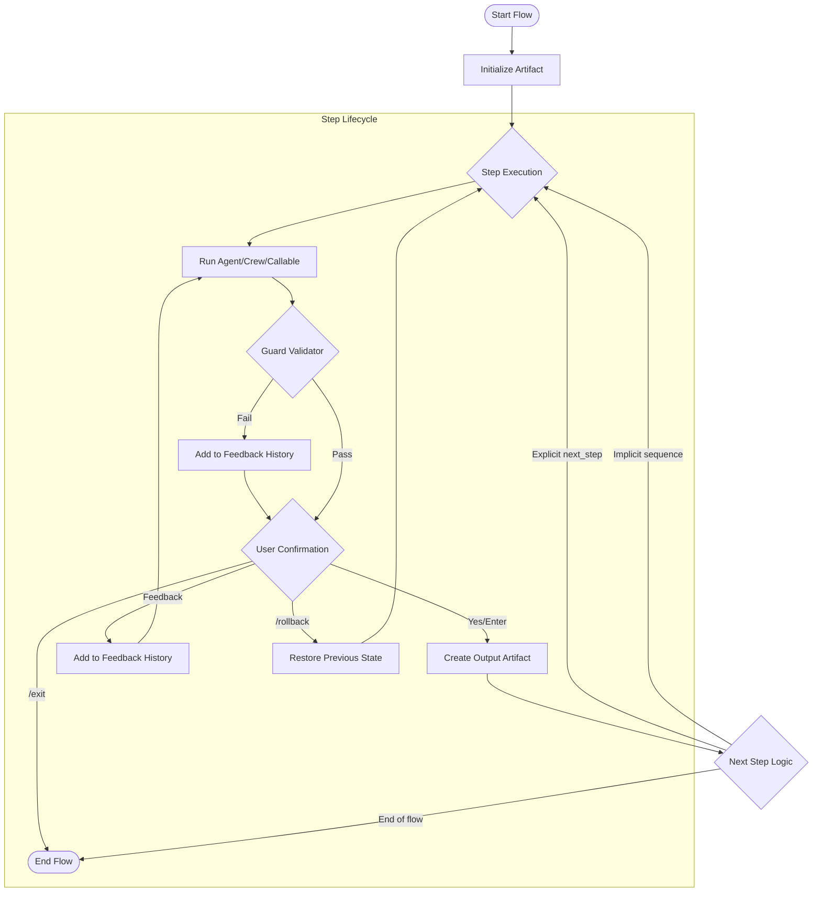

# AIF: Artifact-Oriented Interactive Flow Framework

[](https://github.com/YoiteShao/aif)
[](https://docs.crewai.com)
[](https://www.python.org)

**AIF (Artifact-Oriented Interactive Flow Framework)** is an advanced interactive workflow framework built upon **CrewAI**. It is specifically designed for complex AI tasks that require **Human-in-the-Loop (HITL)**, **Automatic Error Correction**, and **Strict State Control**.

While CrewAI provides excellent multi-agent orchestration, AIF focuses on bridging the gap in **Flow Control** and **User Experience** for production-grade applications, providing a safer and more controllable solution.

---

## 🌟 Why AIF?

| Feature | Standard CrewAI Flows | AIF Advantages |
| :--- | :--- | :--- |
| **Interaction** | Decentralized input, lack of unified control | **InteractionManager Hub**: Centralized management of user inputs supporting commands like `/exit`, `/rollback`, `/retry`, preventing concurrency issues. |
| **Recovery** | Relies on manual restarts or custom logic | **Auto-Correction & Rollback**: Built-in "Generate-Validate-Retry" loop. Supports state rollback with context, allowing users to fix mistakes easily. |
| **State** | Global state, prone to pollution | **Artifact-Oriented**: Data is strictly passed via Artifacts, isolating inputs/outputs between steps to prevent prompt leakage. |
| **HITL** | Requires custom implementation | **Native HITL Support**: Agents can actively ask users for help via `AskUserTool`; Users can intervene at any step via feedback or commands. |
| **Validation** | Manual implementation required | **Flexible Validators**: Support function, Agent, or Crew-based validation with intelligent retry logic. |
| **Debug** | Limited visibility | **Built-in Debug Mode**: Track artifact transmission and step execution with detailed logging. |

---

## 📊 Workflow Diagram



---

## 🚀 Core Architecture

AIF is built around four key components:

### 1. **Artifact** - The Data Carrier

The `Artifact` class is the data carrier between steps, tracking provenance and destination:

```python
class Artifact(BaseModel):
    last_step: str = "system"        # The step that just finished
    next_step: Optional[str] = None  # The step this artifact is destined for
    pass_data: Any = ""              # Data payload (str, dict, or list)
```

**Key Features:**
- **Type Preservation**: Supports `str`, `dict`, and `list` data types natively
- **Data Access**: 
  - `get_data(key=None)`: Get data in original format
  - `get_data_as_str()`: Get string representation for LLM input
- **Lineage Tracking**: Records data flow through `last_step` and `next_step`

### 2. **Step** - The Execution Unit

The `Step` class wraps a `Crew` or `Callable` and manages execution, validation, and retry logic:

```python
step = Step(
    name="step_name",
    step_object=crew_or_callable,
    output_processor=optional_processor,
    should_retry_guard_callback=optional_validator,
    next_step=next_step_logic,
    require_user_confirmation=True
)
```

**Key Features:**
- **Flexible Execution**: Supports both `Crew` and Python `Callable`
- **Output Processing**: Separate display message from pass data via `output_processor`
- **Automatic Retry**: Built-in retry loop with cumulative feedback context
- **AskUserTool Injection**: Automatically injects tool for agents to ask users
- **Validation**: Three types of validators:
  1. **Function**: `(result) -> (should_retry: bool, reason: str)`
  2. **Agent**: Single LLM agent for intelligent validation
  3. **Crew**: Multiple agents for complex validation

**Step as Next Step:**
```python
# Steps can be used directly as next_step parameter
search_step = flow.add_step(Step(name="search", ...))
build_step = flow.add_step(Step(name="build", next_step=search_step, ...))
```

### 3. **AIFFlow** - The Controller

The `AIFFlow` class manages the directed graph of steps and handles control flow:

```python
flow = AIFFlow(interactive=interaction_manager)

# Add steps
flow.add_step_from_crew(
    name="step1",
    step_object=crew,
    output_processor=processor_func,
    guard_callback=validator,
    next_step="step2",  # or Step object, or callable
    require_user_confirmation=True
)

# Or add existing Step objects
flow.add_step(step_object)

# Inspect flow structure
flow.inspect()

# Run the flow
result = await flow.run(initial_input="task description")
```

**Key Features:**
- **Graph-Based Execution**: Supports explicit and implicit step sequencing
- **State Management**: Maintains history stack for rollback
- **Exception Handling**: Catches and processes control flow exceptions
- **Flexible Next Step**: Supports string, Step object, or callable for dynamic routing

**Next Step Logic:**
```python
# 1. String: Direct step name
next_step="step2"

# 2. Step object: Reference to step
next_step=search_step

# 3. Callable: Dynamic routing based on artifact
def route_logic(artifact: Artifact) -> Union[str, Step]:
    if "error" in artifact.get_data_as_str():
        return "error_handler"
    return "success_step"

next_step=route_logic

# 4. None: Use implicit sequence (next step in add order)
next_step=None
```

### 4. **InteractionManager** - The Interaction Hub

The `InteractionManager` abstracts user interaction and manages conversation context:

```python
from aif.interactive import InteractionManager, console_input

# CLI-based interaction
manager = InteractionManager(
    input_callback=console_input,
    initial_input="optional preset input"
)

# Custom async callback (e.g., WebSocket)
async def websocket_input(question: str) -> str:
    await ws.send(question)
    return await ws.receive()

manager = InteractionManager(input_callback=websocket_input)
```

**Key Features:**
- **Command Parsing**: Automatically handles `/exit`, `/rollback`, `/retry`
- **History Tracking**: Maintains conversation history via `add_to_history()`
- **Context Management**: Store/retrieve user context with `set_context()` / `get_context()`
- **Flexible Interface**: Supports both sync and async input callbacks

---

## 💻 Quick Start

### Basic Example

```python
import asyncio
from crewai import Agent, Task, Crew
from aif.flow import AIFFlow
from aif.interactive import InteractionManager, console_input

# 1. Define CrewAI components
agent = Agent(
    role="JSON Generator",
    goal="Generate valid JSON configurations",
    backstory="Expert in JSON formatting"
)

task = Task(
    description="Generate a JSON config based on: {input}",
    expected_output="Valid JSON configuration",
    agent=agent
)

crew = Crew(agents=[agent], tasks=[task])

# 2. Define validator (optional)
def validate_json(result):
    try:
        import json
        json.loads(str(result))
        return False, ""  # Valid, no retry needed
    except:
        return True, "Invalid JSON format"  # Retry needed

# 3. Create flow
interactive = InteractionManager(input_callback=console_input)
flow = AIFFlow(interactive=interactive)

flow.add_step_from_crew(
    name="generate_json",
    step_object=crew,
    guard_callback=validate_json,
    require_user_confirmation=True
)

# 4. Run
async def main():
    result = await flow.run(initial_input="Create a user profile config")
    print("Final Result:", result.get_data_as_str())

if __name__ == "__main__":
    asyncio.run(main())
```

### Multi-Step Flow Example

```python
# Create multiple steps with different configurations
flow = AIFFlow(interactive=interactive)

# Step 1: Search
search_step = flow.add_step_from_crew(
    name="search",
    step_object=search_crew,
    require_user_confirmation=False  # Auto-approve
)

# Step 2: Build (references search_step)
build_step = flow.add_step_from_crew(
    name="build",
    step_object=build_crew,
    guard_callback=build_validator,
    next_step=search_step,  # Can loop back
    require_user_confirmation=True
)

# Step 3: Deploy (dynamic routing)
def route_after_deploy(artifact: Artifact) -> str:
    if "success" in artifact.get_data_as_str():
        return None  # End flow
    return "build"  # Retry build

deploy_step = flow.add_step_from_crew(
    name="deploy",
    step_object=deploy_crew,
    next_step=route_after_deploy
)

# Inspect and run
flow.inspect()
result = await flow.run()
```

### Output Processor Example

Separate step output from human display:

```python
def process_output(raw_result):
    """
    Returns: (display_message, pass_data)
    - display_message: What user sees
    - pass_data: What next step receives (preserves type)
    """
    # Extract structured data
    data = extract_json(raw_result)
    
    # Create user-friendly message
    msg = f"✓ Generated config with {len(data)} fields"
    
    return (msg, data)  # data keeps dict type

flow.add_step_from_crew(
    name="generate",
    step_object=crew,
    output_processor=process_output
)
```

---

## 🎮 User Interaction

### Interactive Commands

At any confirmation prompt, users can:

| Command | Action | Example |
|---------|--------|---------|
| **Enter** or **yes** | Approve and continue | `[Press Enter]` |
| **Direct feedback** | Retry with feedback | `Add more details to the description` |
| **/retry [feedback]** | Explicit retry | `/retry Fix the JSON format` |
| **/rollback [reason]** | Rollback to previous step | `/rollback Wrong model selected` |
| **/exit** | Terminate flow | `/exit` |

### AskUserTool

Agents can proactively ask users for help:

```python
# Automatically injected into all agents in a Crew
# Agents can use it like any other tool:

"""
Agent thought process:
I need to know the user's preferred format.
Action: Ask User
Action Input: {"question": "What format do you prefer: JSON or YAML?"}
"""
```

### Feedback Context Management

AIF intelligently manages feedback across retry attempts:

```python
# First attempt: Original request
inputs = {"input": "Generate a config file"}

# After user feedback: Cumulative context
inputs = {
    "input": """
=== TASK CONTEXT ===
Original request: Generate a config file

=== FEEDBACK HISTORY (in chronological order) ===
(User feedback represents additional requirements from the human user)
(Validation errors are system-level checks that failed)

1. [User Feedback] Add more fields
2. [Validation Error] Missing required 'version' field
3. [User Feedback] Use semantic versioning

=== INSTRUCTIONS ===
Please fulfill ALL requirements above:
1. Complete the original request
2. Address all user feedback
3. Fix all validation errors
"""
}
```

---

## 🔧 Advanced Features

### 1. Validation with Agent/Crew

Use LLM-based validators for intelligent validation:

```python
from crewai import Agent

# Agent-based validator
validator_agent = Agent(
    role="Quality Checker",
    goal="Validate output quality",
    backstory="Expert in quality assurance"
)

flow.add_step_from_crew(
    name="generate",
    step_object=crew,
    guard_callback=validator_agent  # Agent validates intelligently
)

# Crew-based validator (for complex validation)
validation_crew = Crew(
    agents=[syntax_checker, semantic_checker],
    tasks=[check_syntax_task, check_semantic_task]
)

flow.add_step_from_crew(
    name="generate",
    step_object=crew,
    guard_callback=validation_crew
)
```

The validator returns structured feedback:
```json
{
    "should_retry": true,
    "reason": "Output quality issues detected",
    "issues": [
        "Missing required field 'id'",
        "Invalid date format"
    ],
    "suggestions": [
        "Add 'id' field with UUID format",
        "Use ISO 8601 date format"
    ]
}
```

### 2. Debug Mode

Enable detailed logging for development:

```python
from aif.config import aif_config

# Enable artifact transmission debug
aif_config.enable_debug_artifact(True)

# Enable step execution debug
aif_config.enable_debug_step(True)

# Or via environment variables
# AIF_DEBUG_ARTIFACT=true
# AIF_DEBUG_STEP=true
```

Debug output example:
```
      ---------------
      🔍 [Debug] Artifact [Before search] start
      Last Step: system → Next Step: search
      Pass Data: 【user query here】
      ---------------

      ---------------
   🔍 [Debug] Crew kickoff
      - Current Attempt: 2
      - Feedback History (2 items in chronological order):
        1. [user_feedback] Add more details
        2. [validation_error] Missing required fields
   - Actual inputs:      input: === TASK CONTEXT ===
           Original request: user query here
           ...
      ---------------
```

### 3. Callable Steps

Use Python functions as steps:

```python
def process_data(artifact: Artifact) -> Any:
    """Custom processing logic"""
    data = artifact.get_data()
    # Process data
    return processed_result

flow.add_step_from_crew(
    name="process",
    step_object=process_data,  # Callable instead of Crew
    require_user_confirmation=False
)
```

### 4. State Rollback

Rollback preserves context and allows re-execution:

```python
# User triggers rollback
# Input: /rollback Wrong parameters in previous step

# Flow automatically:
# 1. Pops last artifact from history
# 2. Restores previous step's input
# 3. Adds rollback reason to context
# 4. Re-executes the step
```

### 5. Initial Input Priority

Three ways to provide initial input:

```python
# Priority 1: Method parameter (highest)
await flow.run(initial_input="task description")

# Priority 2: InteractionManager preset
manager = InteractionManager(
    input_callback=console_input,
    initial_input="preset task"
)

# Priority 3: Interactive prompt (lowest)
# User will be prompted if no input provided
```

---

## 📁 Project Structure

```
aif/
├── __init__.py
├── artifact.py          # Artifact class - data carrier
├── config.py            # Global configuration and debug settings
├── constant.py          # Constants and type definitions
├── flow.py              # AIFFlow - main controller
├── interactive.py       # InteractionManager and exceptions
├── step.py              # Step class - execution unit
├── tools.py             # AskUserTool implementation
└── validators.py        # Agent/Crew-based validators

qualcomm_example/        # Example implementation
├── qgenie.py           # Main entry point
├── agents.yaml         # Agent configurations
├── tasks.yaml          # Task definitions
├── steps/              # Step implementations
│   ├── search_step.py
│   └── build_step.py
└── knowledge/          # Knowledge base files
```

---

## 🎯 Best Practices

### 1. Step Design
- **Single Responsibility**: Each step should have one clear purpose
- **Idempotent**: Steps should be safe to retry
- **Clear Output**: Use `output_processor` to separate display from data

### 2. Validation
- **Function Validators**: For simple format/syntax checks
- **Agent Validators**: For semantic/quality validation
- **Crew Validators**: For complex multi-aspect validation

### 3. User Confirmation
- **Auto-approve** (`require_user_confirmation=False`): For deterministic steps
- **Require confirmation**: For critical decisions or final outputs

### 4. Error Handling
- **Validation Errors**: Use guard callbacks for automatic retry
- **User Feedback**: Let users provide context for better retry
- **Rollback**: For correcting earlier mistakes

### 5. Debug Mode
- Enable during development for visibility
- Disable in production for cleaner output

---

## 🔄 Comparison with CrewAI Flows

| Aspect | CrewAI Flows | AIF |
|--------|--------------|-----|
| **Step Definition** | `@start()`, `@listen()` decorators | Explicit `Step` objects with configuration |
| **State Management** | Shared state across flow | Isolated `Artifact` per step |
| **User Interaction** | Manual implementation | Built-in `InteractionManager` |
| **Retry Logic** | Manual implementation | Automatic with feedback context |
| **Validation** | Manual checks | Function/Agent/Crew validators |
| **Rollback** | Not supported | Built-in state rollback |
| **Debug** | Limited | Comprehensive debug modes |

---

## 🤝 Contributing

Contributions are welcome! Please feel free to submit a Pull Request.

---

## 📄 License

This project is licensed under the MIT License.

---

## 🙏 Acknowledgments

Built on top of the excellent [CrewAI](https://github.com/joaomdmoura/crewAI) framework.

---

**AIF is not a replacement for CrewAI, but a powerful extension.** When your task involves complex human-in-the-loop scenarios, strict output control, or multi-turn error correction, AIF saves you from writing glue code and makes your workflow robust and production-ready.
