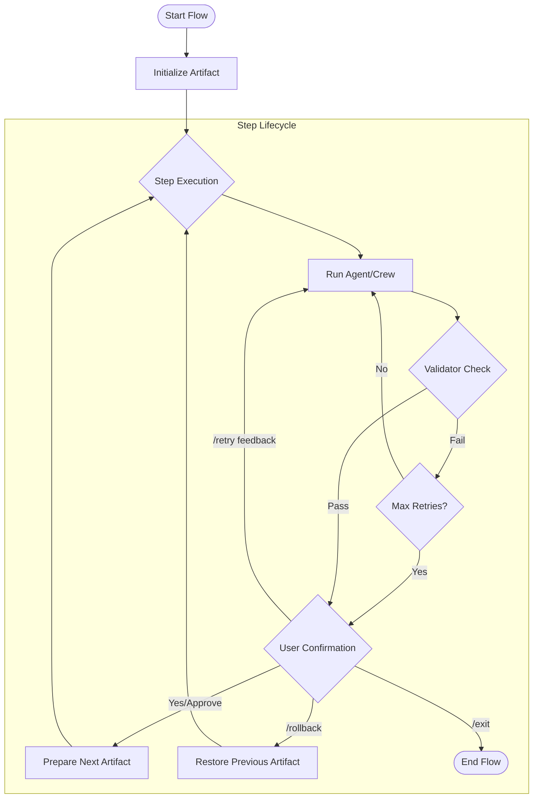

# AIF: Artifact-Oriented Interactive Flow Framework

[](https://github.com/YoiteShao/aif)
[](https://docs.crewai.com)
[](https://www.python.org)

**AIF (Artifact-Oriented Interactive Flow Framework)** is an advanced interactive workflow framework built upon **CrewAI**. It is specifically designed for complex AI tasks that require **Human-in-the-Loop (HITL)**, **Automatic Error Correction**, and **Strict State Control**.

While CrewAI provides excellent multi-agent orchestration, AIF focuses on bridging the gap in **Flow Control** and **User Experience** for production-grade applications, providing a safer and more controllable solution.

## 🌟 Why AIF?

| Feature | Standard CrewAI Flows | AIF Advantages |
| :--- | :--- | :--- |
| **Interaction** | Decentralized input, lack of unified control | **InteractionManager Hub**: Centralized management of user inputs supporting commands like `/exit`, `/rollback`, `/retry`, preventing concurrency issues. |
| **Recovery** | Relies on manual restarts or custom logic | **Auto-Correction & Rollback**: Built-in "Generate-Validate-Retry" loop. Supports state rollback with context, allowing users to fix mistakes easily. |
| **State** | Global state, prone to pollution | **Artifact-Oriented**: Data is strictly passed via Artifacts, isolating inputs/outputs between steps to prevent prompt leakage. |
| **HITL** | Requires custom implementation | **Native HITL Support**: Agents can actively ask users for help; Users can intervene at any step via feedback or commands. |

## 📊 Workflow Diagram



## 🚀 Core Architecture

AIF is built around four key components:

1.  **Step**: The atomic unit of execution.
    *   Wraps a `Crew` or a Python function.
    *   **Auto-Retry**: Automatically retries execution if the `retry_check_callback` fails (up to `max_iterations`).
    *   **AskUserTool**: Automatically injects a tool allowing Agents to ask users for clarification when stuck.
2.  **Artifact**: The data carrier.
    *   Transfers data between Steps.
    *   Tracks lineage (`last_step`, `next_step`).
    *   Strictly separates `last_output` (raw result) from `next_input` (formatted input for next step).
3.  **AIFFlow**: The controller.
    *   Manages the directed graph of Steps.
    *   Handles global control exceptions (`RollbackException`, `UserExitException`).
    *   Maintains history stack for state rollback.
4.  **InteractionManager**: The interaction hub.
    *   Abstracts input interfaces (CLI, WebSocket, etc.).
    *   Intercepts and parses user commands (e.g., `/retry`).
    *   Maintains conversation history and user context.

## 💻 Quick Start

### 1. Define CrewAI Agent and Task

Define your business logic using standard CrewAI components:

```python
from crewai import Agent, Task, Crew

# ... Define your agents and tasks ...
json_agent = Agent(...)
gen_task = Task(...)

my_crew = Crew(agents=[json_agent], tasks=[gen_task])
```

### 2. Wrap in AIF Step

Wrap the Crew in a `Step` and configure validation logic:

```python
from aif.step import Step

# Define a validation function
def validate_json(result):
    if "error" in str(result).lower():
        return True, "Output contains errors" # (Should Retry, Reason)
    return False, ""

# Create the Step
step1 = Step(
    name="GenerateConfig",
    step_object=my_crew,
    retry_check_callback=validate_json,
    max_iterations=3,
    require_user_confirmation=True  # Require user approval before proceeding
)
```

### 3. Build and Run Flow

Create the interactive interface and start the flow:

```python
import asyncio
from aif.flow import AIFFlow
from aif.interactive import InteractionManager

# Define input callback (CLI example, can be WebSocket/API)
async def console_input(question: str) -> str:
    print(f"\n[System]: {question}")
    return input("[User]: ")

# Initialize Interactive Layer
interactive = InteractionManager(input_callback=console_input)

# Initialize Flow
flow = AIFFlow(steps=[step1], interactive=interactive)

# Run
async def main():
    try:
        result = await flow.run()
        print("Final Result:", result.last_output)
    except Exception as e:
        print("Flow Error:", e)

if __name__ == "__main__":
    asyncio.run(main())
```

## 🎮 Interaction Commands

Users have full control during the flow execution. At any input prompt, the following commands are available:

*   **`/retry [feedback]`**:
    *   **Action**: Rejects the current step's result and requests a retry.
    *   **Example**: `/retry The JSON format is incorrect, missing 'id' field.`
    *   **Behavior**: The current Step receives the feedback and re-executes.

*   **`/rollback [reason]`**:
    *   **Action**: Rolls back to the previous Step.
    *   **Example**: `/rollback I chose the wrong model in the previous step.`
    *   **Behavior**: System state reverts to the start of the previous Step, allowing re-input or re-execution.

*   **`/exit`**:
    *   **Action**: Immediately terminates the flow.

## 📂 Directory Structure

*   `aif/core/`: Core data structures (Artifact, Tools, Types)
*   `aif/flow.py`: Flow control logic
*   `aif/step.py`: Step execution and retry logic
*   `aif/interactive.py`: User interaction handling
*   `example/`: Usage examples

---

**AIF is not a replacement for CrewAI, but a powerful extension.** When your task involves complex human-in-the-loop scenarios, strict output control, or multi-turn error correction, AIF saves you from writing glue code and makes your workflow robust.
